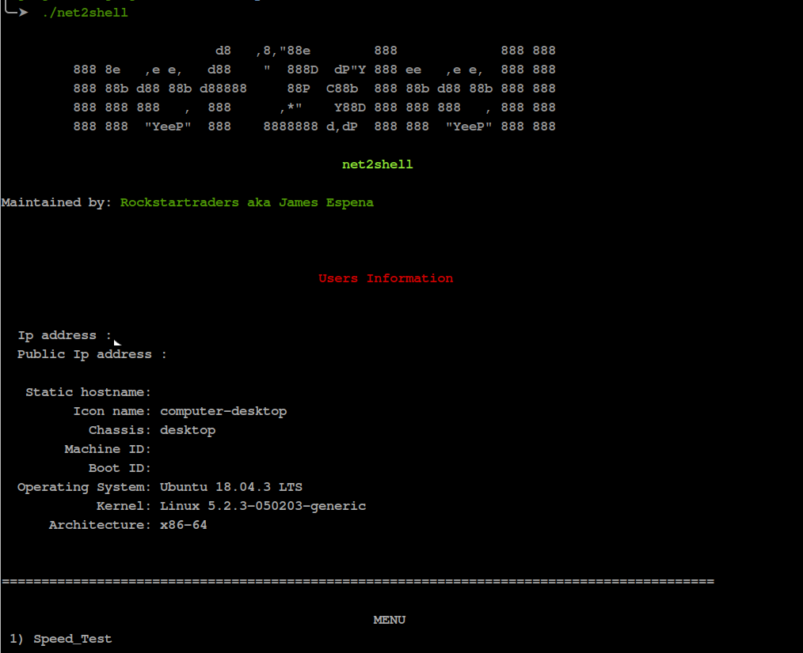

<h1>

net2shell 

</h1>

- This is a compilation of all the network command I used.

- As always I'm lazy when it comes to typing the commands over and over again that is why I utilize the power of bash scripting.... LOL.

- I only did the automation but I am not the one who created the packages included via this script.

 ### Install Instruction: 

1. Clone the this repo. 
    #### `git clone https://github.com/rockstartraders/net2shell`

   If git is not installed just download it then extract it to your pc.
 
 
 
 2. After cloning go to the directory.

      #### `cd net2shell`

 
 

   3. Change Permission.

      #### `chmod u+x install.sh and net2shell.sh`
         If permission error occurs you know the drill  [sudo](https://en.wikipedia.org/wiki/Sudo) is the key.

 

   4. run the installer (this will install all the necessary package required for this script). 

      #### `./install.sh or ./install`

    Currently I am using debian base distro and using Apt as my package manager but feel free to modify it base on the package manager that you are using.  
        
  

5. Just wait for it to finish then run 
      #### `./net2shell.sh or ./net2shell.sh`

 
 

>>

 ### Screenshot

 1. I remove other information via this screenshot such as IP address, machine name and hostname. 
  

  

 
  
  2. Menu 
 

